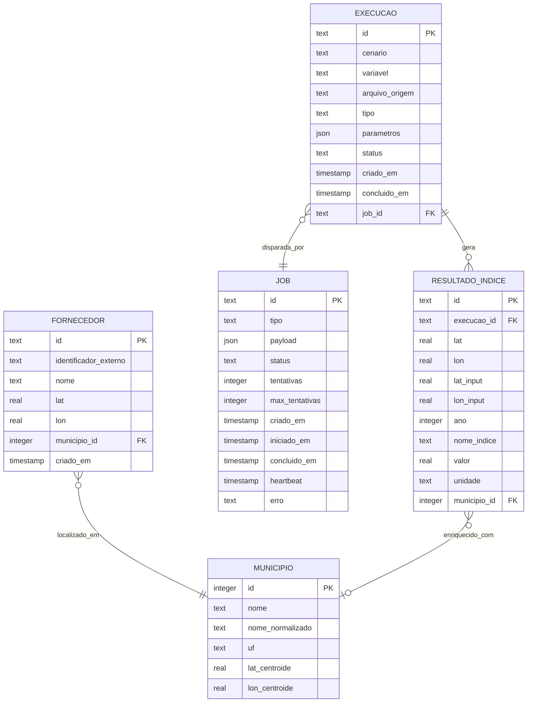
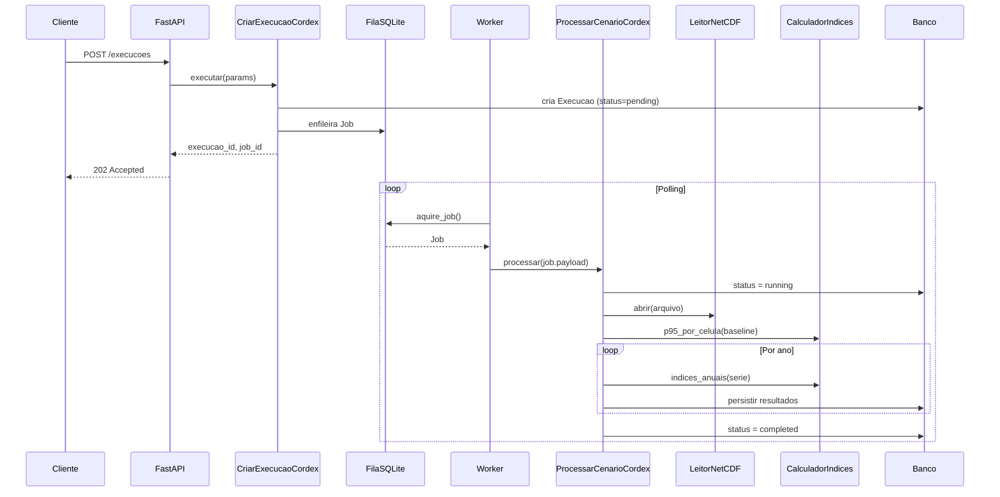
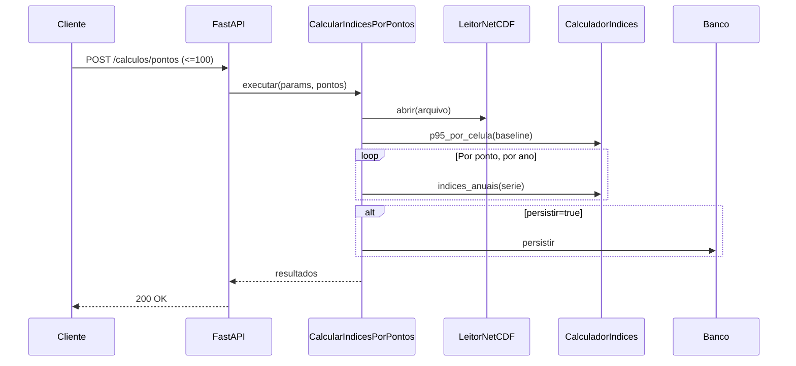
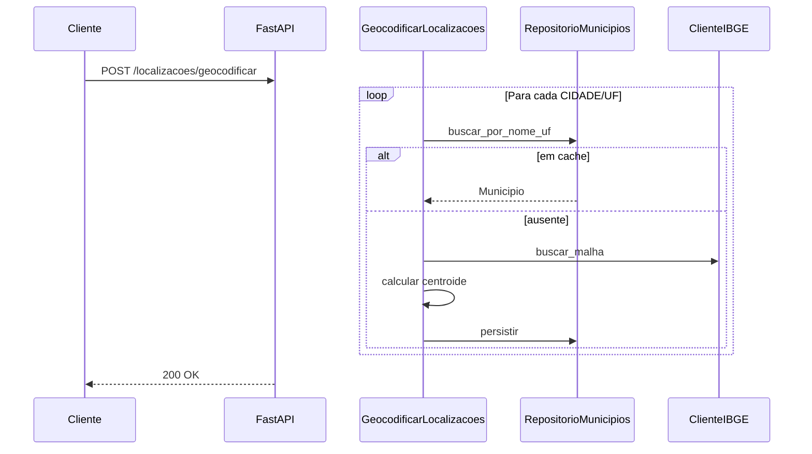

# Desenho da API e Arquitetura Alvo

## 1. Princípios do Desenho

- **REST pragmático.** Nomes claros prevalecem sobre purismo.
- **Recursos de primeira classe:** `localizacoes`, `fornecedores`, `execucoes`, `resultados`, `jobs`.
- **Verbos de ação** permitidos como sub-resources onde CRUD não cabe (ex.: `POST /execucoes/{id}/cancelar`).
- **Idempotência explícita:** operações de criação aceitam `client_reference_id` opcional.
- **Erros padronizados** seguindo RFC 7807 (Problem Details).
- **Paginação** consistente via `limit` / `offset` com resposta contendo `total`, `items`, `limit`, `offset`.

## 2. Endpoints

### 2.1 Localizações

| Método | Path | Descrição | Modo |
|---|---|---|---|
| POST | `/localizacoes/geocodificar` | Converte CIDADE/UF em coordenadas via IBGE | Sync |
| POST | `/localizacoes/localizar` | Inverso: lat/lon → UF/município via shapefile | Sync |
| GET | `/localizacoes/municipios` | Lista municípios em cache (paginada) | Sync |

### 2.2 Fornecedores

| Método | Path | Descrição |
|---|---|---|
| POST | `/fornecedores` | Cadastra fornecedor (um ou lote) |
| GET | `/fornecedores` | Lista (paginada) |
| GET | `/fornecedores/{id}` | Detalhe |
| DELETE | `/fornecedores/{id}` | Remove |
| POST | `/fornecedores/importar` | Importa CSV/XLSX |

### 2.3 Execuções CORDEX (UC-02)

| Método | Path | Descrição |
|---|---|---|
| POST | `/execucoes` | Cria execução (enfileira job). Retorna 202 |
| GET | `/execucoes` | Lista (paginada, filtros: cenario, variavel, status) |
| GET | `/execucoes/{id}` | Detalhe |
| POST | `/execucoes/{id}/cancelar` | Tenta cancelar job pendente |

### 2.4 Cálculo para pontos (UC-03)

| Método | Path | Descrição | Modo |
|---|---|---|---|
| POST | `/calculos/pontos` | ≤100 pontos: síncrono. >100: job async | Híbrido |

### 2.5 Resultados (UC-05)

| Método | Path | Descrição |
|---|---|---|
| GET | `/resultados` | Consulta com filtros ricos |
| GET | `/resultados/agregados` | Agregações |

### 2.6 Cobertura (UC-04)

| Método | Path | Descrição |
|---|---|---|
| POST | `/cobertura/fornecedores` | Identifica fornecedores sem cobertura na grade |

### 2.7 Jobs

| Método | Path | Descrição |
|---|---|---|
| GET | `/jobs` | Lista (paginada) |
| GET | `/jobs/{id}` | Detalhe |
| POST | `/jobs/{id}/retry` | Reexecuta job falho |

### 2.8 Administração

| Método | Path | Descrição |
|---|---|---|
| GET | `/health` | Liveness |
| GET | `/health/ready` | Readiness |
| POST | `/admin/ibge/refresh` | Repopula cache IBGE |
| GET | `/admin/stats` | Estatísticas gerais |

## 3. Contratos Principais (exemplos)

### 3.1 `POST /execucoes`

**Request:**
```json
{
  "arquivo_nc": "/dados/cordex/rcp45/pr_day_BR_2026-2030.nc",
  "cenario": "rcp45",
  "variavel": "pr",
  "bbox": {
    "lat_min": -33.75, "lat_max": 5.5,
    "lon_min": -74.0, "lon_max": -34.8
  },
  "parametros_indices": {
    "freq_thr_mm": 20.0,
    "p95_wet_thr": 1.0,
    "heavy20": 20.0,
    "heavy50": 50.0,
    "p95_baseline": { "inicio": 2026, "fim": 2035 }
  },
  "geocodificar_resultados": true,
  "client_reference_id": "job-abc-123"
}
```

**Response (202):**
```json
{
  "execucao_id": "exec_01HX...",
  "job_id": "job_01HX...",
  "status": "pending",
  "criado_em": "2026-04-16T10:30:00Z",
  "links": {
    "self": "/execucoes/exec_01HX...",
    "job": "/jobs/job_01HX..."
  }
}
```

### 3.2 `POST /calculos/pontos`

**Request:**
```json
{
  "arquivo_nc": "/dados/cordex/rcp45/pr_day_BR_2026-2030.nc",
  "cenario": "rcp45",
  "variavel": "pr",
  "pontos": [
    { "lat": -23.55, "lon": -46.63, "identificador": "forn-001" }
  ],
  "parametros_indices": { "freq_thr_mm": 20.0, "p95_wet_thr": 1.0 },
  "persistir": true
}
```

### 3.3 Erro (RFC 7807)

```json
{
  "type": "https://api.local/errors/arquivo-nc-nao-encontrado",
  "title": "Arquivo NetCDF não encontrado",
  "status": 404,
  "detail": "Arquivo '/dados/cordex/rcp45/missing.nc' não existe.",
  "instance": "/execucoes",
  "correlation_id": "req_01HX..."
}
```

## 4. Casos de Uso (camada application)

| Caso de uso | Dependências (portas) | Disparado por |
|---|---|---|
| `GeocodificarLocalizacoes` | ClienteIBGE, RepositorioMunicipios | POST /localizacoes/geocodificar |
| `LocalizarCoordenadas` | LeitorShapefile, RepositorioMunicipios | POST /localizacoes/localizar |
| `CadastrarFornecedor` | RepositorioFornecedores | POST /fornecedores |
| `ImportarFornecedores` | RepositorioFornecedores, GeocodificarLocalizacoes | POST /fornecedores/importar |
| `CriarExecucaoCordex` | RepositorioExecucoes, FilaJobs | POST /execucoes |
| `ProcessarCenarioCordex` | LeitorNetCDF, CalculadorIndices, RepositorioResultados, RepositorioExecucoes | Worker |
| `CalcularIndicesPorPontos` | LeitorNetCDF, CalculadorIndices, RepositorioResultados | POST /calculos/pontos |
| `ConsultarResultados` | RepositorioResultados | GET /resultados |
| `AgregarResultados` | RepositorioResultados | GET /resultados/agregados |
| `IdentificarCoberturaFornecedores` | RepositorioResultados, RepositorioFornecedores | POST /cobertura/fornecedores |
| `ConsultarJobs` | RepositorioJobs | GET /jobs |
| `ReprocessarJob` | RepositorioJobs, FilaJobs | POST /jobs/{id}/retry |

## 5. Modelo de Dados (SQLite, formato longo)



### Decisões de modelagem

| Aspecto | Decisão |
|---|---|
| IDs | ULID (text, 26 chars) |
| Campos JSON | TEXT em SQLite, migrável para JSONB em Postgres |
| Timestamps | ISO 8601 UTC em TEXT |
| Enum status | CHECK constraint |
| Índices | (execucao_id, ano, nome_indice); (status, criado_em); (uf, nome_normalizado) |
| Soft delete | Não no MVP |
| Geoespacial | Sem PostGIS; consultas BBOX via WHERE lat/lon; raio em Shapely |

### Schema da fila (job)

```sql
CREATE TABLE job (
    id             TEXT PRIMARY KEY,
    tipo           TEXT NOT NULL,
    payload        TEXT NOT NULL,
    status         TEXT NOT NULL DEFAULT 'pending'
                   CHECK (status IN ('pending','running','completed','failed','canceled')),
    tentativas     INTEGER NOT NULL DEFAULT 0,
    max_tentativas INTEGER NOT NULL DEFAULT 3,
    criado_em      TEXT NOT NULL,
    iniciado_em    TEXT,
    concluido_em   TEXT,
    heartbeat      TEXT,
    erro           TEXT,
    proxima_tentativa_em TEXT
);

CREATE INDEX idx_job_pending_fila
    ON job (status, proxima_tentativa_em)
    WHERE status = 'pending';
```

## 6. Estrutura de Pastas

```
climate-risk-api/
├── pyproject.toml
├── uv.lock
├── .env.example
├── README.md
├── alembic.ini
├── migrations/
│   └── versions/
├── docs/
│   ├── adrs/
│   ├── analise-inicial.md
│   ├── diagnostico-consolidado.md
│   ├── desenho-api.md
│   └── plano-refatoracao.md
├── src/
│   └── climate_risk/
│       ├── domain/
│       │   ├── indices/
│       │   ├── unidades/
│       │   ├── espacial/
│       │   ├── entidades/
│       │   ├── portas/
│       │   └── excecoes.py
│       ├── application/
│       │   ├── geocodificacao/
│       │   ├── fornecedores/
│       │   ├── execucoes/
│       │   ├── calculos/
│       │   ├── resultados/
│       │   ├── cobertura/
│       │   └── jobs/
│       ├── infrastructure/
│       │   ├── db/
│       │   ├── netcdf/
│       │   ├── ibge/
│       │   ├── shapefile/
│       │   ├── fila/
│       │   └── geocodificacao/
│       ├── interfaces/
│       │   ├── app.py
│       │   ├── dependencias.py
│       │   ├── middleware/
│       │   ├── schemas/
│       │   └── rotas/
│       ├── core/
│       │   ├── config.py
│       │   ├── logging.py
│       │   ├── ids.py
│       │   └── tempo.py
│       └── cli/
│           ├── api.py
│           └── worker.py
├── tests/
│   ├── unit/
│   ├── integration/
│   ├── e2e/
│   ├── fixtures/
│   └── conftest.py
├── legacy/              (codigo antigo de referencia)
└── scripts/
```

## 7. Fluxos Principais

### 7.1 Processamento CORDEX em grade (UC-02)



### 7.2 Cálculo síncrono por pontos (UC-03)



### 7.3 Geocodificação (UC-01)



## 8. Decisões Transversais

### 8.1 Configuração

`.env` lido por `pydantic-settings`:

```
CLIMATE_RISK_DATABASE_URL=sqlite+aiosqlite:///./climate_risk.db
CLIMATE_RISK_LOG_LEVEL=INFO
CLIMATE_RISK_WORKER_POLL_INTERVAL_SECONDS=2
CLIMATE_RISK_WORKER_HEARTBEAT_SECONDS=30
CLIMATE_RISK_JOB_TIMEOUT_PROCESSAR_CORDEX_SECONDS=7200
CLIMATE_RISK_JOB_TIMEOUT_CALCULAR_PONTOS_SECONDS=1800
CLIMATE_RISK_IBGE_BASE_URL=https://servicodados.ibge.gov.br
CLIMATE_RISK_SHAPEFILE_UF_PATH=
CLIMATE_RISK_SHAPEFILE_MUN_PATH=
CLIMATE_RISK_SINCRONO_PONTOS_MAX=100
```

### 8.2 Logs
- JSON estruturado, uma linha por evento.
- `correlation_id` propagado via middleware, herdado por jobs via payload.
- API: stdout. Worker: stdout + arquivo rotativo.

### 8.3 Injeção de dependência
FastAPI `Depends` para wiring. Casos de uso recebem dependências via construtor.

### 8.4 Tratamento de erro
- Exceções de domínio definidas em `domain/excecoes.py`.
- Middleware converte em Problem Details (RFC 7807).
- Jobs que falham 3× são marcados `failed`.

### 8.5 Worker
- Processo único.
- Loop: adquire → processa → heartbeat cada 30s → conclui/falha → repete.
- Shutdown limpo via SIGTERM.
- Sweep periódico recupera jobs zumbis.
