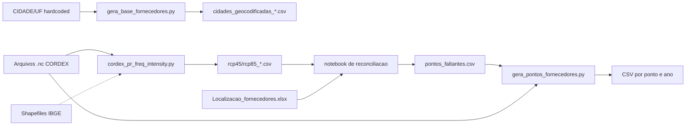

# Diagnóstico Consolidado

## 1. Visão Geral

O repositório atual é, na prática, um **pipeline batch de avaliação de risco climático para fornecedores**, composto por quatro estágios acoplados via arquivos intermediários no filesystem. A documentação existente cobre apenas um desses estágios, o que gera descompasso significativo entre o sistema real e sua descrição formal.

O objetivo desta transformação é consolidar esses estágios em um **sistema único, servido como API HTTP local**, com arquitetura em camadas explícitas, persistência em SQLite e processamento assíncrono via fila nativa. O comportamento funcional será preservado; melhorias estruturais não devem introduzir regressões.

## 2. Estado Atual — Síntese

### 2.1 Composição do repositório

| Arquivo | Função | Situação |
|---|---|---|
| `cordex_pr_freq_intensity.py` | Pipeline CORDEX em grade completa (BBOX) | Ativo, documentado |
| `gera_pontos_fornecedores.py` | Pipeline CORDEX em pontos exatos | Ativo, não documentado |
| `gera_base_fornecedores.py` | Geocodificação de cidades via IBGE | Ativo, não documentado |
| `locais_faltantes_fornecedores.ipynb` | Reconciliação fornecedores × grade | Exploratório |
| `teste.py` | — | Código morto |
| `code_doc.docx` | Documentação parcial | Desatualizada |

### 2.2 Fluxo de dados atual

Acoplamento é exclusivamente via filesystem. Nenhum módulo Python importa outro.

### 2.3 Caracterização arquitetural

**Padrão atual:** conjunto de scripts procedurais independentes. Não há camadas, nem abstrações sobre I/O, nem módulo compartilhado — apesar de existirem ~15 funções duplicadas entre os dois scripts CORDEX.

**Pontos de entrada:** três CLIs (argparse) + um notebook + um script hardcoded. Inconsistência na forma de uso.

## 3. Dívida Técnica — Consolidada e Priorizada

### 3.1 Alta prioridade

| ID | Problema | Impacto |
|---|---|---|
| DT-01 | Duplicação massiva entre os dois scripts CORDEX (~15 funções) | Correção em dois lugares; risco de divergência silenciosa |
| DT-02 | Lista de entrada hardcoded em `gera_base_fornecedores.py` | Requer edição de código para trocar dados |
| DT-03 | Ausência total de testes automatizados | Sem rede de segurança contra regressões |
| DT-04 | Ausência de especificação de ambiente | Reprodutibilidade não garantida |
| DT-05 | Heurística `vmax < 5.0` não documentada | Pode produzir resultados incorretos em células áridas |
| DT-06 | Mistura de responsabilidades em `write_rows` e `process_file` | Leitura, cálculo, lookup e escrita acoplados |

### 3.2 Média prioridade

| ID | Problema |
|---|---|
| DT-07 | `teste.py` é código morto |
| DT-08 | Cabeçalhos/docstrings duplicados em `gera_base_fornecedores.py` |
| DT-09 | Encoding inconsistente nos CSVs |
| DT-10 | Tipagem parcial |
| DT-11 | Tratamento de erro genérico |
| DT-12 | `log()` ad-hoc reimplementado |
| DT-13 | Notebook não reprodutível isoladamente |
| DT-14 | Nomenclatura mista PT/EN |

## 4. Qualidades do Código Atual (Preservar)

- **Núcleo numérico puro e bem identificável.** `annual_indices_for_series` é determinística e encapsula a lógica de negócio climática.
- **Robustez de I/O em NetCDF.** Múltiplas engines, lat/lon 1D e 2D, calendários não-padrão, unidades variáveis.
- **Logs explícitos ao longo do pipeline.**
- **Conversor de longitude 0–360 → -180–180** correto.
- **Fallback de abertura de CSV** em `load_points_csv` — lida com dados imperfeitos.

## 5. Riscos Técnicos

| # | Risco | Severidade | Mitigação |
|---|---|---|---|
| R-01 | Heurística `vmax < 5.0` distorce resultados em células áridas | Baixa-Média | ADR-007: preservar no MVP, plano explícito de remoção |
| R-02 | Ausência de baseline de regressão antes de refatorar | **Alta** | Etapa 5 começa congelando saídas atuais |
| R-03 | API do IBGE indisponível | Média | Cache em banco; consulta externa só para não-cacheados |
| R-04 | Arquivos NetCDF grandes estouram memória | Média | Limites operacionais; chunking com `dask` futuro |
| R-05 | Calendários não-padrão em CORDEX geram divergência sutil | Média | Testes de regressão incluem `.nc` com calendário não-padrão |
| R-06 | Dependências C (HDF5) podem quebrar sem Docker para isolar | Média | Documentar versões exatas no README |
