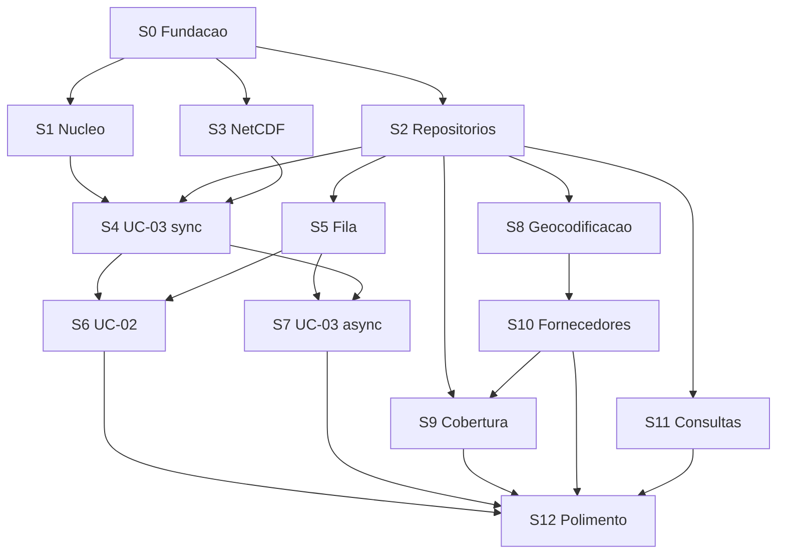

# Plano de Refatoração Incremental

## Princípios

1. **Slices verticais**, não horizontais. Cada slice entrega valor end-to-end.
2. **Baseline primeiro.** Nenhuma refatoração antes de congelar comportamento atual.
3. **Menor risco primeiro.** Ordem por risco crescente e dependência.
4. **"Tudo quebra junto ou nada quebra."** Cada slice termina com build verde, testes verdes, baseline aprovada.
5. **Coexistência temporária.** Código antigo e novo convivem; código antigo é removido apenas no slice final.

## Slice 0 — Fundação e Baseline

**Objetivo:** infraestrutura de repositório, ambiente, testes e baseline numérica.

**Entregáveis:**
- Projeto com `uv` + `pyproject.toml`.
- Estrutura de pastas vazia (conforme desenho).
- Configuração de `ruff`, `mypy`, `pytest`.
- `.env.example` e `core/config.py`.
- `core/logging.py` com formatter JSON.
- SQLite + Alembic inicializados (schema vazio).
- FastAPI app com `/health`.
- CI (GitHub Actions): lint + typecheck + test.
- Baseline de regressão capturada.
- README com bootstrap.

**Baseline:**
- `.nc` sintéticos pequenos gerados pelo próprio slice.
- Opcionalmente `.nc` real fornecido externamente, com golden files em `tests/fixtures/baselines/real/`.
- Tolerância: `rtol=1e-6, atol=1e-9` para floats, igualdade estrita para ints/strings.

**Critérios de conclusão:**
- [ ] `uv run pytest` passa.
- [ ] `uv run ruff check` passa.
- [ ] `uv run mypy src/` passa.
- [ ] `/health` responde 200.
- [ ] Migration inicial aplicada.
- [ ] Baseline sintética congelada.
- [ ] README permite bootstrap em ≤15 min.

## Slice 1 — Núcleo numérico puro

**Mapeamento:**
| Código antigo | Código novo |
|---|---|
| `annual_indices_for_series` | `domain/indices/calculadora.py` |
| `compute_p95_grid` | `domain/indices/p95.py` |
| `convert_pr_to_mm_per_day` | `domain/unidades/conversores.py` |
| `ensure_lon_negpos180`, `normalize_lon` | `domain/espacial/longitude.py` |
| `coords_to_2d` | `domain/espacial/grade.py` |
| `build_in_bbox_mask` | `domain/espacial/bbox.py` |
| `find_nearest_idx` | `domain/espacial/grade.py` |

**Decisões:**
- Preservar bit-a-bit, incluindo heurística `vmax < 5.0` (ADR-007).
- Dataclasses imutáveis para retornos.
- Cobertura >85% em `domain/`.

**Ponto de rollback:** descartar pastas do domínio.
**Risco:** baixo.

## Slice 2 — Modelos e repositórios

**Entregáveis:**
- Modelos SQLAlchemy (`infrastructure/db/modelos.py`).
- Migration inicial.
- Repositórios: Municipios, Fornecedores, Execucoes, Resultados, Jobs.
- Interfaces em `domain/portas/`.
- Testes de integração com SQLite in-memory.

**Ponto de rollback:** dropar banco e remover pasta.
**Risco:** baixo-médio.

## Slice 3 — Leitor NetCDF

**Mapeamento:**
| Código antigo | Código novo |
|---|---|
| `open_nc_multi`, `safe_open_with_copy` | `infrastructure/netcdf/leitor_xarray.py` |
| `guess_latlon_vars`, `infer_scenario` | mesmo arquivo |

**Contrato:**
```python
@dataclass(frozen=True)
class DadosClimaticos:
    dados_diarios: np.ndarray
    lat_2d: np.ndarray
    lon_2d: np.ndarray
    anos: np.ndarray
    cenario: str
    unidade_original: str
    calendario: str
```

**Erros:** ErroArquivoNCNaoEncontrado, ErroVariavelAusente, ErroDimensaoTempoAusente.

**Risco:** médio.

## Slice 4 — UC-03 síncrono fim-a-fim (primeiro vertical completo)

**Entregáveis:**
- Caso de uso `CalcularIndicesPorPontos`.
- Endpoint `POST /calculos/pontos`.
- Schemas Pydantic.
- Middleware de erros + correlation_id.
- Teste e2e.

**Critérios:**
- Rejeita >100 pontos com 400 (async vem no Slice 7).
- Paridade com código antigo via baseline.

**Risco:** médio. **Valor de aprendizado: alto.**

## Slice 5 — Fila de jobs e worker

**Entregáveis:**
- Interface `FilaJobs`.
- Implementação SQLite com `UPDATE ... RETURNING` atômico.
- Worker com polling, heartbeat, retry com backoff, sweep de zumbis.
- Endpoints `GET /jobs`, `GET /jobs/{id}`, `POST /jobs/{id}/retry`.
- Job-type "noop" para validar.

**Risco:** médio-alto.

## Slice 6 — UC-02 assíncrono (processamento de grade)

**Entregáveis:**
- `CriarExecucaoCordex` (enfileira).
- `ProcessarCenarioCordex` (worker).
- Endpoints de execuções.

**Risco:** alto. Reúne domínio + banco + NetCDF + fila.

## Slice 7 — UC-03 assíncrono

**Entregáveis:**
- Job-type `calcular_pontos_lote`.
- Endpoint retorna 202 quando >100 pontos.

**Risco:** baixo.

## Slice 8 — Geocodificação (UC-01)

**Mapeamento:**
| Código antigo | Código novo |
|---|---|
| `carregar_municipios_ibge`, `_get_geojson_municipio` | `infrastructure/ibge/cliente_http.py` |
| `normaliza_nome`, `casar_cidade`, `parse_lista` | `infrastructure/geocodificacao/matcher_fuzzy.py` |
| `_centroide_de_feature`, `obter_latlon_por_id` | `infrastructure/geocodificacao/centroide.py` |
| `processar` | `application/geocodificacao/geocodificar_localizacoes.py` |

**Decisões:**
- `httpx` em vez de `requests`.
- Cache em `RepositorioMunicipios`, sem TTL no MVP.

**Risco:** baixo-médio.

## Slice 9 — Localização inversa + Cobertura (UC-04)

**Mapeamento:**
| Código antigo | Código novo |
|---|---|
| `geocode_points_with_shapes`, `pick_name_col` | `infrastructure/shapefile/leitor_geopandas.py` |
| Lógica do notebook | `application/cobertura/identificar.py` |

**Risco:** baixo-médio.

## Slice 10 — Fornecedores CRUD

**Entregáveis:**
- `CadastrarFornecedor`, `ImportarFornecedores`.
- Endpoints completos.
- Importação aceita CSV/XLSX; opcionalmente geocodifica.

**Risco:** baixo.

## Slice 11 — Consultas de resultados

**Entregáveis:**
- `ConsultarResultados` com filtros ricos.
- `AgregarResultados`.
- Consulta por raio em km via Shapely.

**Risco:** baixo.

## Slice 12 — Polimento e descontinuação

**Entregáveis:**
- `/health/ready`, `/admin/stats`.
- Remoção dos scripts antigos.
- Notebook convertido em teste ou exemplo documentado.
- Documentação final.

**Risco:** baixo.

## Dependências entre Slices



## Marcos Visíveis

| Marco | Slices | Significado |
|---|---|---|
| M1 | S4 | Primeira chamada HTTP útil |
| M2 | S6 | Processamento completo async |
| M3 | S8 | Geocodificação substituída |
| M4 | S11 | Paridade funcional total |
| M5 | S12 | Código antigo removido |

## Definição de "Pronto"

Cada slice requer:
- [ ] `ruff check` passa.
- [ ] `mypy` passa no nível exigido.
- [ ] Cobertura atinge mínimo da camada.
- [ ] Testes unitários + integração + e2e passam.
- [ ] Baseline de regressão valida.
- [ ] ADR novo ou atualizado, se houver decisão.
- [ ] Docs refletem o novo estado.
- [ ] PR revisado.

## Critérios de Bloqueio

- Divergência de baseline fora da tolerância → **bloqueia**.
- Regressão de teste pré-existente → **bloqueia**.
- Dívida não registrada em backlog/ADR → **bloqueia**.
